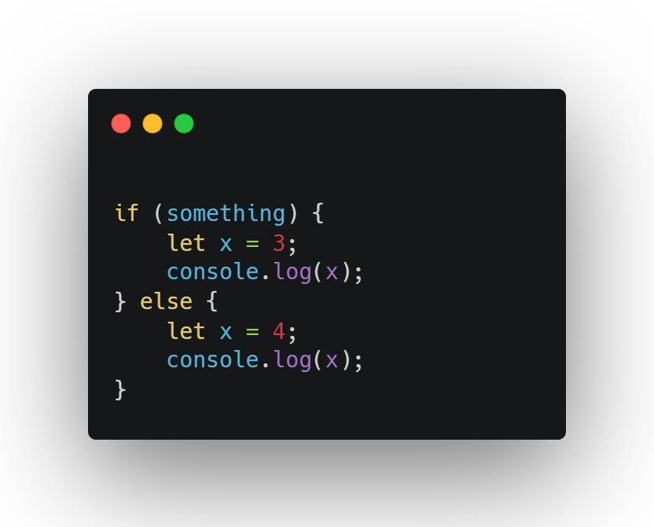
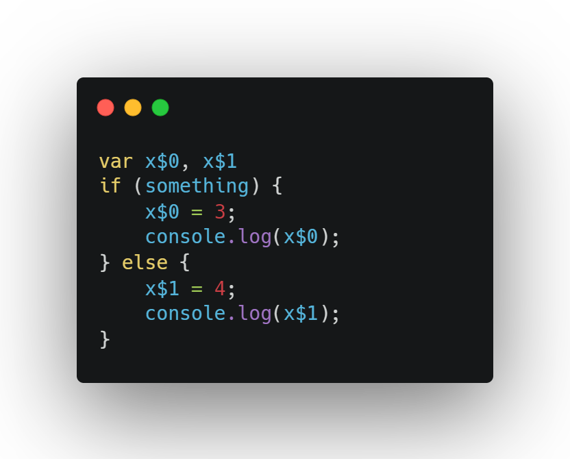
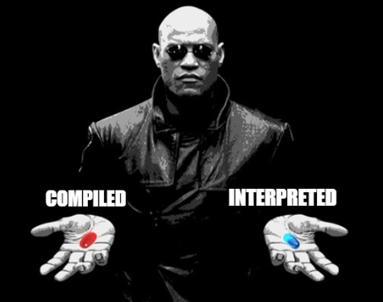
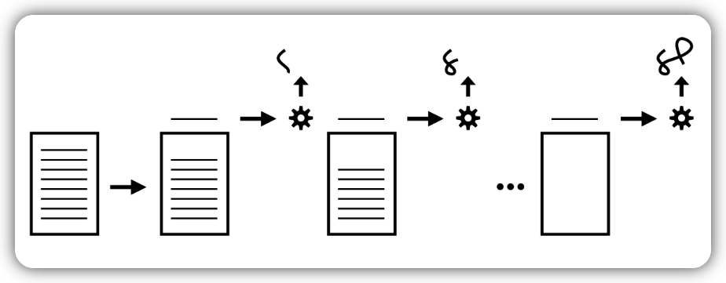
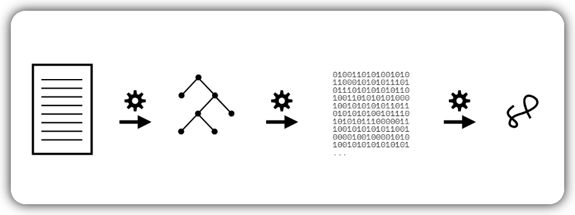
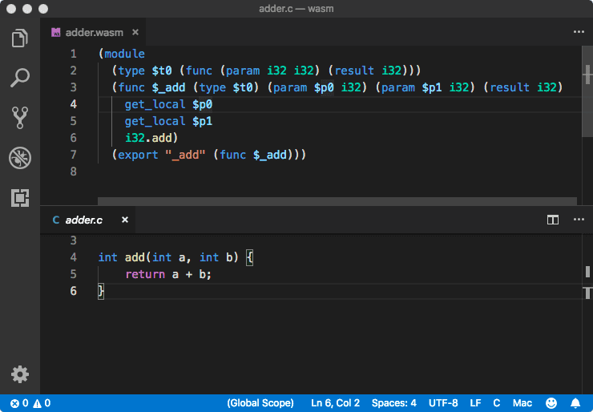

# Chapter 1: What _Is_ Javascript?

This first part was a little bit tricky because there are some things needed to specify in order to understand what _Javascript_ is.

First, is not related to _Java_. Actually the name is more an artifact of marketing because it was intended to apppeal to Java programmers, plus, the word **script** was very popular back then, so:  

Java + script = _Javascript_ was born

Nowadays the official name of the language is _ECMAScript_. This was specified by the TC39[^1] (_Technical Committee number 39_: TC39 is a group of JavaScript developers, implementers, academics, and more, collaborating with the community to maintain and evolve the definition of JavaScript.) and formalized by the [ECMA](https://www.ecma-international.org/) Standards. Having it's own revision every year, so for example  your browser can be running something like _ECMAScript 2019_ or _ES2019_ for short. 😱

That's why there is some kind of implicit agreement between programmers to call the language _ES20`XX`_ or just _JS_ in order to avoid confusion. 😵

## The Web Rules Everything About (JS)

Javascript is present in many places, from browsers, to servers (_NodeJS_), to robots, IOT, etc... But the one that rules JS is the web.


## Not All (Web) JS…

Not all the features we use in our regular basis are part of the ECMAScript Standard, lets take the following piece of code:

```javascript
alert("Hello, this is an Alert 😺")
```
This line of code displays the following:


The `alert(..)` function is not included in the JS specification, but is something present in all web JS environments. That's why diferent environments like browsers or _NodeJS_ add APIs to provide JS programs with environment-specific capabilities. Lets see some examples of these API capabilities:

* [`fetch(..)`](https://developer.mozilla.org/en-US/docs/Web/API/Fetch_API/Using_Fetch) provides a JavaScript interface for accessing and manipulating parts of the protocol, such as requests and responses.
* [`getCurrentLocation(..)`](https://developer.mozilla.org/en-US/docs/Web/API/Geolocation/getCurrentPosition) is used to get the current position of the device.
* [`getUserMedia(..)`](https://developer.mozilla.org/en-US/docs/Web/API/MediaDevices/getUserMedia) prompts the user for permission to use a media input.
* [`fs.write(..)`](https://nodejs.dev/en/learn/writing-files-with-nodejs/) easiest way to write to files in Node.js.

Even the well-known `console.log(..)` and all the `console.*` methods are not specified in JS, but due to it's universal utility is defined in most of the JS environments.

## Paradigms 

This section treats the paradigms within JS. But "What is a paradigm?" Basically is an approach to solve problem using some programming language or also we can say it is a method to solve a problem using tools and techniques that are available to us following some approach. Within a paradigm, there are myriad variations of style and form that distinguish programs, this can include libraries, frameworks, etc... 

Some important categories[^2] are:

* **Procedural**: organizes code in a top-down, linear progression through a pre-determined set of operations, usually collected together in related units called procedures. Examples: _C, Algol_
* **Object-Oriented (OO/classes)**: organizes code by collecting logic and data together into units called classes.  Examples: _Java, C#_
* **Functional (FP)**: organizes code into functions. Examples: _Haskell, Lisp_

Of course there are languages that support more than one code patterns, these are called _«multi-paradigm languages»_. In our case Javascript is on of them.

## Backwards & Forwards

First, we need to keep clear some definitions, those are: _backwards compatibility_ and _forward compatibility_.

* **Backwards compatibility** means that once something is accepted as valid JS, there will not be a future change to the language that causes that code to become invalid JS. This means that code written two or ten years ago should still work today, even code from the 90's should still run today with some issues maybe. All this is made in order to JS developers write code with confidence that it won't stop working out of the blue due to a browser update. 😎

That's why the TC39 is extremely cautious in doing so. They study the impact of those possible changes and browsers ultimately decide to adopt those changes with the cost of breaking a very small amount of sites or comparing if the benefits of the new features improve somehow for many more sites.

* **Forward compatibility** means that including a new addition to the language in a program would not cause that program to break if it were run in an older JS engine.

> **JS is not forwards-compatible** 😳

## Jumping the Gaps

Since JS is not forwards-compatible, it means that there is always the potential for a gap between code that you can write that’s valid JS, and the oldest engine that your site or application needs to support. Let's see an example:

For this example I took the `fromEntries` function which is an _ES2019_ feature the simply converts a list of key-value pairs into an object.​                

```javascript
const fruits = [
    ["apples", 300],
    ["pears", 900],
    ["bananas", 500]
    ];
    
const myObj = Object.fromEntries(fruits);
```
Running this piece of code in _NodeJS 11.0.0_ give us an error whereas running this in the latest version I have on my computer (_18.12.1_) runs without any problem.

```
const myObj = Object.fromEntries(fruits);
                         ^
TypeError: Object.fromEntries is not a function
```

So in order to overcome this issue, the solution is *transpiling*. It's a term to describe using a tool to convert the source code of a program from one form to another (but still as textual source code). Typically, forwards-compatibility problems related to syntax are solved by using a transpiler like _Babel_ to convert from that newer JS syntax version to an equivalent older syntax.

| Code      | Babel |
| ----------- | ----------- |
|     |    |

The reason to have this kind of tools is the encourage developers to use the latest version of JS so the code can be clean and communicates its ideas most effectively.

> Developers should focus on writing the clean, new syntax forms, and let the tools take care of producing a forwards-compatible version of that code that is suitable to deploy and run on the oldest-supported JS engine environments. _(Page 30)_

## Filling the Gaps

> If the forwards-compatibility issue is not related to new syntax, but rather to a missing API method that was only recently added, the most common solution is to provide a definition for that missing API method that stands in and acts as if the older environment had already had it natively defined. This pattern is called a **polyfill**.

An example of this goes as follows[^3]:

The function `Math.trunc(n)` will fail in some old engines (very outdated ones).

So, for this particular case, the polyfill for `Math.trunc` is a script that implements it, like this:

```javascript
if (!Math.trunc) { // if no such function
  // implement it
  Math.trunc = function(number) {
    // Math.ceil and Math.floor exist even in ancient JavaScript engines
    return number < 0 ? Math.ceil(number) : Math.floor(number);
  };
}
```

Transpilation and polyfilling are two highly effective techniques for addressing that gap between code that uses the latest stable features in the language and the old environments a site or application needs to still support.

## Deep Dive Javascript



This was an interesting topic to read about because I always took for granted that Javascript is intrerpreted, but with some things under the hood that made me feel, that wasn't entirely true.

The first thing that made me think JS is just another interpreted language was that usually we distribute the source code, not the binary form. But this actually is a misconception, it doesn’t really matter so much anymore what form of a program gets passed around. Making a recap on how scripted or interpreted languages work, they're generally executed top-down and line-by-line 


<p align="center">
  
</p>

in contrast to compiled languages that go thru the process of parsing. In this processing model, an invalid command (such as broken syntax) would be caught during the parsing phase, before any execution has begun, and none of the program would run.


<p align="center">
  
  
</p>

> JS source code is parsed before it is executed. The specification requires as much, because it calls for “early errors”—statically determined errors in code, such as a duplicate parameter name—to be reported before the code starts executing. Those errors cannot be recognized without the code having been parsed.JS source code is parsed before it is executed. The specification requires as much, because it calls for “early errors”—statically determined errors in code, such as a duplicate parameter name—to be reported before the code starts executing. Those errors cannot be recognized without the code having been parsed.

So **JS is a parsed language**, but is it compiled?

The parsed JS is converted to an optimized (binary) form, and that “code” is subsequently executed; the engine does not commonly switch back into line-by-line execution mode after it has finished all the hard work of parsing—most languages/engines wouldn’t, because that would be highly inefficient.

So, in summary the execution goes as follow:

1. After a program leaves a developer’s editor, it gets transpiled by Babel, then packed by Webpack (and perhaps halfa dozen other build processes), then it gets delivered in that very different form to a JS engine.

2. The JS engine parses the code to an AST.

3. Then the engine converts that AST to a kind-of byte code, a binary intermediate representation (IR), which is then refined/converted even further by the optimizing JIT compiler.

4. The JS VM executes the program.

<p align="center">

V8 Execution Process
</p>

## Web Assembly (WASM)

This is a section related to performance. As a fun fact there was port of [Unreal 3 game from C to JS.](https://www.wired.com/2013/03/mozilla-epic-bring-unreal-3-gaming-engine-to-the-web/) For that a subset of the JS language was used: _ASM.js_. It was never intended to be code written by developers, but a representation of code from other languages into JS. After some years Web Assembly (WASM) was released. _WASM_ is similar to _ASM.js_ in that its original intent was to provide a path for non-JS programs (C, etc.) to be converted to a form that could run in the JS engine.

 

## Strict Mode 🤨

With the release of ES5 (2009), JS added `strict mode` as a mechanism for encouraging better JS programs. But, why strict mode? Even if programmers in a team are developing something are strict enough using linters or any other tool. `strict mode` are in the form of early errors, meaning errors that aren’t strictly syntax errors but are still thrown at compile time (before the code is run).


[^1]: Ecma International's TC39, [https://tc39.es](https://tc39.es/#:~:text=Ecma%20International's%20TC39%20is%20a,evolve%20the%20definition%20of%20JavaScript.)

[^2]: [OOP vs Functional vs Procedural](https://www.scaler.com/topics/java/oop-vs-functional-vs-procedural/)

[^3]: Example of [Polyfill](https://javascript.info/polyfills)
