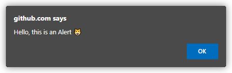

# Chapter 1: What _Is_ Javascript?

This first part was a little bit tricky because there are some things needed to specify in order to understand what _Javascript_ is.

First, is not related to _Java_. Actually the name is more an artifact of marketing because it was intended to apppeal to Java programmers, plus, the word **script** was very popular back then, so:  

Java + script = _Javascript_ was born

Nowadays the official name of the language is _ECMAScript_. This was specified by the TC39[^1] (_Technical Committee number 39_: TC39 is a group of JavaScript developers, implementers, academics, and more, collaborating with the community to maintain and evolve the definition of JavaScript.) and formalized by the [ECMA](https://www.ecma-international.org/) Standards. Having it's own revision every year, so for example  your browser can be running something like _ECMAScript 2019_ or _ES2019_ for short. 😱

That's why there is some kind of implicit agreement between programmers to call the language _ES20`XX`_ or just _JS_ in order to avoid confusion. 😵

## The Web Rules Everything About (JS)

Javascript is present in many places, from browsers, to servers (_NodeJS_), to robots, IOT, etc... But the one that rules JS is the web.


## Not All (Web) JS…

Not all the features we use in our regular basis are part of the ECMAScript Standard, lets take the following piece of code:

```javascript
alert("Hello, this is an Alert 😺")
```
This line of code displays the following:



The `alert(..)` function is not included in the JS specification, but is something present in all web JS environments. That's why diferent environments like browsers or _NodeJS_ add APIs to provide JS programs with environment-specific capabilities. Lets see some examples of these API capabilities:

* [`fetch(..)`](https://developer.mozilla.org/en-US/docs/Web/API/Fetch_API/Using_Fetch) provides a JavaScript interface for accessing and manipulating parts of the protocol, such as requests and responses.
* [`getCurrentLocation(..)`](https://developer.mozilla.org/en-US/docs/Web/API/Geolocation/getCurrentPosition) is used to get the current position of the device.
* [`getUserMedia(..)`](https://developer.mozilla.org/en-US/docs/Web/API/MediaDevices/getUserMedia) prompts the user for permission to use a media input.
* [`fs.write(..)`](https://nodejs.dev/en/learn/writing-files-with-nodejs/) easiest way to write to files in Node.js.

Even the well-known `console.log(..)` and all the `console.*` methods are not specified in JS, but due to it's universal utility is defined in most of the JS environments.

## Paradigms 

This section treats the paradigms within JS.

## Backwards & Forwards

## Jumping the Gaps

## Filling the Gaps

## Deep Dive Javascript

## Web Assembly (WASM)

## Strict Mode 🤨


[^1]: Ecma International's TC39, [https://tc39.es](https://tc39.es/#:~:text=Ecma%20International's%20TC39%20is%20a,evolve%20the%20definition%20of%20JavaScript.)