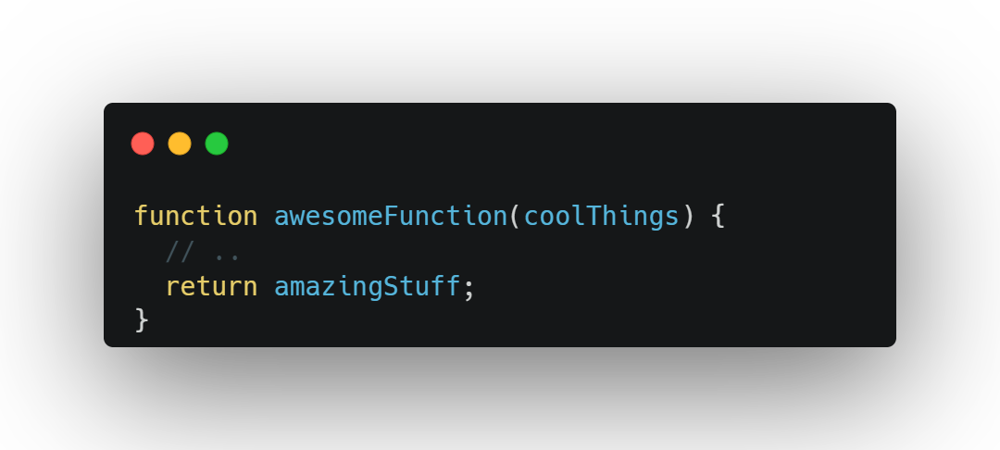
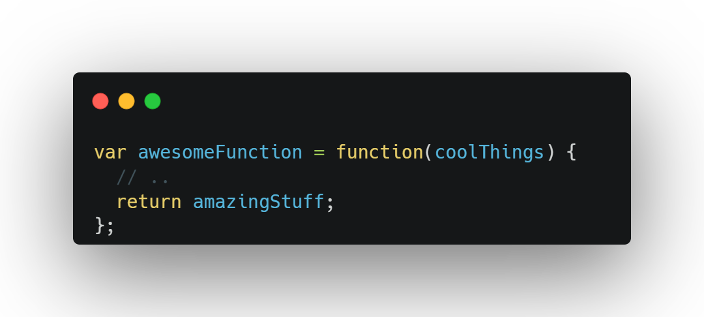

# Chapter 2: Surveying JS 

## Each File is a Program

Technically speaking in JS, each file is its own separate program. The main reason for this is error handling, one file may fail and that will not necessarily prevent the next file from being processed.

## Values

Values come in two forms in JS: **primitive** and **object**.

### Strings
---

Let's begin with ways to print strings 😱, we can use `""`, `''` and finally ``. We're going to asume the is a variable called `firstName='Leo'`:

```javascript
console.log("My name is ${ firstName }."); // My name is ${ firstName }.
console.log('My name is ${ firstName }.'); // My name is ${ firstName }.
console.log(`My name is ${ firstName }.`); // My name is Leo.
```

The last example is called **interpolation**.

### Booleans and Numbers
---
Well..., what can I say, the only thing interesting about this section is that JS has a _bigint_. LoL


### `null` and `undefined`
---

Both values serve the purpose of indicating emptiness (or absence) of a value. It’s safest and best to use only undefined as the single empty value, even though null seems attractive in that it’s shorter to type.

### Symbol
---

Special-purpose value that behaves as a hidden unguessable value. Symbols are almost exclusively used as special keys on objects.

```javascript
Symbol("Gordon Freeman")
```

They’re mostly used in low-level code such as in libraries and frameworks.

## Arrays And Objects

This is an array:

```javascript
names = [ "Frank", "Kyle", "Peter", "Susan" ];
```
Thanks for you attention.

<details>
  <summary>Nah, there is more</summary>
    JS arrays can hold any value type, either primitive or object (including other arrays).
</details>

And this is an `object`:

```javascript
name = {
    first: "Gordon", 
    last: "Freeman", 
    age: 27, 
    specialties: ["JS", "Scientist"]
}; 
console.log(`My name is ${name.first}.`);
```

## Value Type Determination

There is an operator called `typeof` that tells you its built-in type, if primitive, or "object" otherwise:

```javascript
typeof 42;                  // "number"
typeof "abc";               // "string"
typeof true;                // "boolean"
typeof undefined;           // "undefined"
typeof null;                // "object"
typeof { "a": 1 };          // "object"
typeof [1,2,3];             // "object"
typeof function hello(){};  // "function"
```

Intersting to highlight:

> `typeof null` unfortunately returns `"object"` instead of the expected `"null"`. Also, `typeof` returns the specific `"function"` for functions, but not the expected `"array"` for arrays. 🤯

Converting from one value type to another, such as from string to number, is referred to in JS as **“coercion.”**

## Declaring and Using Variables

`var` and `let` statement: 

```javascript
var name = "Gordon";
let lastname = "Freeman"
```
But, what is the difference between them?

To summarize `let` allows a more limited access to the variable than `var`. This is called **block scoping** as opposed to regular or function scoping.

```javascript
var adult = true;
if (adult) { 
    var name = "Gordon"; 
    let age = 27; 
    console.log("Shhh, this is a secret!");
}
console.log(name); // Gordon
console.log(age); // Error!
```

Block-scoping is very useful for limiting how widespread variable declarations are in our programs, which helps prevent accidental overlap of their names.

Another way to declare variables is by using the `const` declaration. It’s like let but has an additional limitation that it must be given a value at the moment it’s declared, and cannot be re-assigned a different value later. Basically `const` declared variables are not **unchangeable**, they just cannot be re-assigned.  Lets see an example:

```javascript

const games = ["Blasphemous", "Half-Life", "God of War"];

games[1]= "Halo";   // This will work
games = [1,2,3]     // Error!

```

## Functions

| Function Declaration      | Function Expression |
| ----------- | ----------- |
|     |    |

Different from the function declaration form, a function expression is not associated with its identifier until that statement during runtime. In JS, functions are values that can be assigned and passed around. Thanks to that property functions can be assigned as properties on objects:

```javascript
var whatToSay = {
    greeting() {
        console.log("Hello!");
    }, 
    question() { 
        console.log("What's your name?"); 
    }, 
    answer() { 
        console.log("My name is Kyle."); 
    }
}; 

whatToSay.question();
```
## Comparisons

Being aware of the difference between **equality** and **equivalence** is an important thing in javascript.

### The strict equality operator (`===`)

Basically the operator does the following, it checks both the value and the type. But there’s more to it than that, though. All value comparisons in JS consider the type of the values being compared, not just the `===` operator. Specifically, `===` **disallows** any sort of type conversion (aka, “coercion”) in its comparison, where other JS comparisons do allow coercion.

But there is a twist on this theory:

  

 ```javascript
 NaN === NaN;  // false
 0 === -0;     // true
 ```

 The story gets even more complicated when we consider comparisons of object values (non-primitives) 🥴: 

 ```javascript
[ 1, 2, 3 ] === [ 1, 2, 3 ];  // false 
{ a: 42 } === { a: 42 }       // false
(x => x * 2) === (x => x * 2) // false
 ```

This happens because all object values are held by reference.

### Coercive Comparisons

If the value types being compared are different, the `==` differs from `===` in that it allows coercion before the comparison. In other words, they both want to compare values of like types, but == allows type conversions first, and once the types have been converted to be the same on both sides, then `==` does the same thing as `===`. Due to this nature `==` prefers primitive and numeric comparisons so we can avoid this kind of things:

> `"" == 0` or `0 == false`.

## How We Organize in JS

Two major patterns for organizing code (data and behavior) are used broadly across the JS ecosystem: classes and modules.
