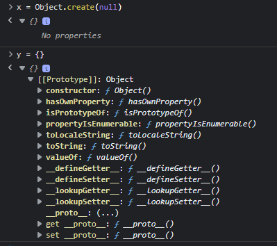

# Chapter 3: Digging to the Roots of JS

This chapter is about going deeper in JS.

## Iteration

After many years of various JS community efforts around mutually agreed-upon iteration techniques, ES6 standardized a specific protocol for the iterator pattern directly in the language. The protocol defines a `next()` method whose return is an object called an iterator result; the object has value and done properties, where `done` is a boolean that is false until the iteration over the underlying data source is complete.

### Consuming Iterators

Checking after each `next()` call for done to be true to stop the iteration. But this approach is rather manual, so ES6 also included several mechanisms (syntax and APIs) for standardized consumption of these iterators.


One such mechanism is the `for..of` loop. Another mechanism that’s often used for consuming iterators is the `...` (spread) operator. 

## Iterables

The iterator-consumption protocol is technically defined for consuming iterables; an **iterable is a value that can be iterated over**. An example of this are arrays and since arrays are iterables, we can shallow-copy an array using iterator consumption via the spread operator:

```javascript
var arrCopy = [ ...arr ];
```

A `Map` is also an iterable but insted of iterating thru values it iterates on _entries_. An entry is a tuple (2-element array) including both a key and a value.

In the `for..of` loop over the default map iteration, we use the `[key,value]` syntax (called _“array destructuring”_) to break down each consumed tuple into the respective key/value pairs.

```javascript
var characters = new Map();
characters.set("Penitente",{HP:  100, DMG: 10, DEF: 2 }); 
characters.set("Querubin",{HP:  50, DMG: 5, DEF: 4 });

for (let [name,stats] of characters) { 
    // ... 
}
```
## Closure

Closure is when a function remembers and continues to access variables from outside its scope, even when the function is executed in a different scope. So, in summary closure is part of the nature of a function and to observe a closure, the function must be executed in a different scope than where that function was originally defined. Example:

```javascript
function greeting(msg) { 
    return function who(name) { 
        console.log(`${ msg }, ${ name }!`);
    }; 
}

var hello = greeting("Hello"); 
var howdy = greeting("Howdy");

hello("Kyle"); // Hello, Kyle!
hello("Sarah"); // Hello, Sarah!
howdy("Grant"); // Howdy, Grant!
```

Closure is most common when working with asynchronous code.

## `this` Keyword

For this section, the example is enough to understand the point:

```javascript
function classroom(teacher) {
    return function study() {
        console.log(`${teacher} says to study ${this.topic}`
        );
    };
} 
var assignment = classroom("Kyle");

assignment(); // Kyle says to study undefined :O

// But if we give context to the function, we can do as follows
var homework = {
    topic: "JS", assignment: assignment
};
homework.assignment(); // Kyle says to study JS :)
```
Another way to call give a function a context is thru the `call()` method.

```javascript
var otherHomework = { topic: "Math"
};
assignment.call(otherHomework); // Kyle says to study Math
```

## Prototypes

Where `this` is a characteristic of function execution, a prototype is a characteristic of an object. A prototype is a linkage between two objects and it occurs when an object is created. A series of objects linked together via prototypes is called the **“prototype chain.”**

We can consider the following example:

```javascript
var homework = { 
    topic: "JS"
};

console.log(homework.toString()); // homework just has one attribute, but this line displays [object Object]
```

The above hapens because its default prototype linkage connects to the `Object.prototype` object, which has common built-in methods on it like `toString()` and `valueOf()`, among others. `homework.toString()` works even though homework doesn’t have a `toString()` method defined; the delegation invokes `Object.prototype.toString()` instead.

## Object Linkage

We can use the `create(..)` method to define an object prototype:

```javascript
var homework = { 
    topic: "JS"
};
var otherHomework = Object.create(homework); 
otherHomework.topic; // "JS"
```

I found this situation: 
> Object.create(null) creates an object that is not prototype linked anywhere, so it’s purely just a standalone object; in some circumstances, that may be preferable.

But still dont manage to have an interesting use for that: 



We can do a mix of function context and object prototype:

```javascript
var homework = {
    study() {
        console.log(`Please study ${this.topic}`);
    }
};

var jsHomework = Object.create(homework); 
jsHomework.topic = "JS"; 
jsHomework.study(); // Please study JS

var mathHomework = Object.create(homework); 
mathHomework.topic = "Math"; 
mathHomework.study(); // Please study Math
```

The two objects `jsHomework` and `mathHomework` each prototype link to the single homework object, which has the `study()` function. `jsHomework` and `mathHomework` are each given their own `topic` property